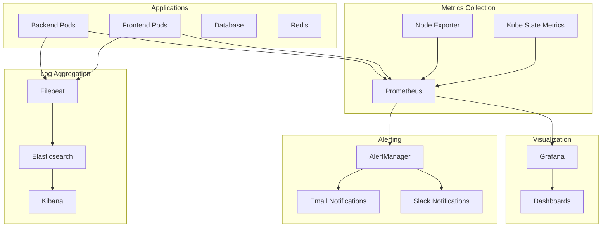

# Task 11.4: Verify Monitoring and Alerting Systems

## Overview

This guide provides comprehensive instructions for deploying and validating monitoring and alerting systems for DhakaCart. The setup includes Prometheus for metrics collection, Grafana for visualization, AlertManager for notifications, and ELK stack for log aggregation and analysis.

## Prerequisites

Before deploying monitoring systems, ensure you have:

1. **Infrastructure deployed** (Task 11.1 completed)
2. **Applications deployed** (Task 11.2 completed)
3. **Load balancing configured** (Task 11.3 completed)
4. **Helm** installed for package management
5. **kubectl** configured for your EKS cluster
6. **Sufficient cluster resources** for monitoring stack

## Architecture Overview

### Monitoring Stack Components



### Key Features
- **Real-time metrics** collection and visualization
- **Multi-channel alerting** (email, Slack, SMS)
- **Centralized logging** with search and analysis
- **Custom dashboards** for business and technical metrics
- **SLA monitoring** and compliance reporting

## Implementation Steps

### Step 1: Deploy Prometheus Stack

#### Add Helm Repositories

1. **Add Prometheus community repository**:
   ```bash
   helm repo add prometheus-community https://prometheus-community.github.io/helm-charts
   helm repo update
   ```

#### Create Monitoring Namespace

1. **Create namespace**:
   ```bash
   kubectl create namespace monitoring
   ```

#### Deploy Prometheus Operator

1. **Install kube-prometheus-stack**:
   ```bash
   helm install prometheus prometheus-community/kube-prometheus-stack \
     --namespace monitoring \
     --values kubernetes/monitoring/prometheus/values.yaml \
     --wait --timeout=600s
   ```

2. **Verify deployment**:
   ```bash
   kubectl get pods -n monitoring
   kubectl get svc -n monitoring
   ```

#### Configure Prometheus

1. **Check Prometheus configuration**:
   ```bash
   kubectl get prometheus -n monitoring -o yaml
   ```

2. **Verify targets are being scraped**:
   ```bash
   kubectl port-forward -n monitoring svc/prometheus-operated 9090:9090
   # Access http://localhost:9090/targets
   ```

### Step 2: Configure Grafana

#### Access Grafana

1. **Get Grafana admin password**:
   ```bash
   kubectl get secret -n monitoring prometheus-grafana -o jsonpath="{.data.admin-password}" | base64 --decode
   ```

2. **Access Grafana UI**:
   ```bash
   kubectl port-forward -n monitoring svc/prometheus-grafana 3000:80
   # Access http://localhost:3000 (admin/password from above)
   ```

#### Import Dashboards

1. **Apply custom dashboards**:
   ```bash
   kubectl apply -f kubernetes/monitoring/prometheus/dashboards/
   ```

2. **Import community dashboards**:
   - Kubernetes Cluster Overview (ID: 7249)
   - Node Exporter Full (ID: 1860)
   - Kubernetes Pods (ID: 6417)

#### Configure Data Sources

1. **Prometheus data source** (usually auto-configured):
   - URL: `http://prometheus-operated:9090`
   - Access: Server (default)

2. **Elasticsearch data source** (for logs):
   - URL: `http://elasticsearch-master:9200`
   - Index name: `filebeat-*`
   - Time field: `@timestamp`

### Step 3: Deploy AlertManager

#### Configure AlertManager

1. **Create AlertManager configuration secret**:
   ```bash
   kubectl create secret generic alertmanager-config \
     --from-file=alertmanager.yml=kubernetes/monitoring/prometheus/alertmanager/alertmanager.yaml \
     -n monitoring
   ```

2. **Update AlertManager configuration**:
   ```yaml
   # Edit the secret with actual notification endpoints
   kubectl edit secret alertmanager-config -n monitoring
   ```

#### Configure Notification Channels

1. **Email Configuration**:
   ```yaml
   global:
     smtp_smarthost: 'smtp.gmail.com:587'
     smtp_from: 'alerts@dhakacart.com'
     smtp_auth_username: 'alerts@dhakacart.com'
     smtp_auth_password: 'your-app-password'
     smtp_require_tls: true
   ```

2. **Slack Configuration**:
   ```yaml
   global:
     slack_api_url: 'https://hooks.slack.com/services/YOUR/SLACK/WEBHOOK'
   ```

3. **Test notification channels**:
   ```bash
   # Send test alert
   kubectl port-forward -n monitoring svc/alertmanager-operated 9093:9093
   # Access http://localhost:9093 and use "New Silence" to test
   ```

### Step 4: Deploy Prometheus Rules

#### Apply Alerting Rules

1. **Deploy DhakaCart-specific alerts**:
   ```bash
   kubectl apply -f kubernetes/monitoring/prometheus/rules/dhakacart-alerts.yaml
   ```

2. **Verify rules are loaded**:
   ```bash
   kubectl get prometheusrules -n dhakacart
   kubectl port-forward -n monitoring svc/prometheus-operated 9090:9090
   # Check http://localhost:9090/rules
   ```

#### Key Alert Rules

**Application Performance Alerts**:
- High error rate (>5% for 2 minutes)
- High response time (>2 seconds for 5 minutes)
- Pod crash looping

**Infrastructure Alerts**:
- High CPU usage (>90% for 10 minutes)
- High memory usage (>90% for 5 minutes)
- Pod not ready

**Business Alerts**:
- Order rate dropped (50% below yesterday)
- High cart abandonment rate (>80%)
- Payment failure rate high (>10%)

### Step 5: Deploy ELK Stack for Log Aggregation

#### Add Elastic Helm Repository

1. **Add repository**:
   ```bash
   helm repo add elastic https://helm.elastic.co
   helm repo update
   ```

#### Deploy Elasticsearch

1. **Install Elasticsearch**:
   ```bash
   helm install elasticsearch elastic/elasticsearch \
     --namespace monitoring \
     --values kubernetes/monitoring/elk/elasticsearch/values.yaml \
     --wait --timeout=600s
   ```

2. **Verify Elasticsearch cluster**:
   ```bash
   kubectl get pods -n monitoring -l app=elasticsearch-master
   kubectl port-forward -n monitoring svc/elasticsearch-master 9200:9200
   curl http://localhost:9200/_cluster/health
   ```

#### Deploy Kibana

1. **Install Kibana**:
   ```bash
   helm install kibana elastic/kibana \
     --namespace monitoring \
     --values kubernetes/monitoring/elk/kibana/values.yaml \
     --wait --timeout=300s
   ```

2. **Access Kibana**:
   ```bash
   kubectl port-forward -n monitoring svc/kibana-kibana 5601:5601
   # Access http://localhost:5601
   ```

#### Deploy Filebeat

1. **Install Filebeat**:
   ```bash
   helm install filebeat elastic/filebeat \
     --namespace monitoring \
     --values kubernetes/monitoring/elk/filebeat/values.yaml \
     --wait --timeout=300s
   ```

2. **Verify log collection**:
   ```bash
   kubectl logs -n monitoring -l app=filebeat
   ```

#### Configure Kibana Dashboards

1. **Import log dashboards**:
   ```bash
   kubectl apply -f kubernetes/monitoring/elk/kibana/dashboards/
   ```

2. **Create index patterns**:
   - Pattern: `filebeat-*`
   - Time field: `@timestamp`

### Step 6: Configure Application Metrics

#### Add Metrics to Backend Application

1. **Install Prometheus client** (if not already done):
   ```javascript
   // In backend/package.json
   "dependencies": {
     "prom-client": "^14.2.0"
   }
   ```

2. **Add metrics collection** (`backend/metrics.js`):
   ```javascript
   const client = require('prom-client');
   
   // Create a Registry
   const register = new client.Registry();
   
   // Add default metrics
   client.collectDefaultMetrics({ register });
   
   // Custom metrics
   const httpRequestsTotal = new client.Counter({
     name: 'http_requests_total',
     help: 'Total number of HTTP requests',
     labelNames: ['method', 'route', 'status_code'],
     registers: [register]
   });
   
   const httpRequestDuration = new client.Histogram({
     name: 'http_request_duration_seconds',
     help: 'Duration of HTTP requests in seconds',
     labelNames: ['method', 'route'],
     buckets: [0.1, 0.5, 1, 2, 5],
     registers: [register]
   });
   
   // Business metrics
   const ordersTotal = new client.Counter({
     name: 'dhakacart_orders_total',
     help: 'Total number of orders',
     registers: [register]
   });
   
   const cartsCreated = new client.Counter({
     name: 'dhakacart_carts_created_total',
     help: 'Total number of carts created',
     registers: [register]
   });
   
   module.exports = {
     register,
     httpRequestsTotal,
     httpRequestDuration,
     ordersTotal,
     cartsCreated
   };
   ```

3. **Add metrics endpoint** (`backend/index.js`):
   ```javascript
   const { register } = require('./metrics');
   
   // Metrics endpoint
   app.get('/metrics', async (req, res) => {
     res.set('Content-Type', register.contentType);
     res.end(await register.metrics());
   });
   ```

#### Configure Service Monitor

1. **Create ServiceMonitor** (`servicemonitor.yaml`):
   ```yaml
   apiVersion: monitoring.coreos.com/v1
   kind: ServiceMonitor
   metadata:
     name: dhakacart-backend-monitor
     namespace: dhakacart
     labels:
       app: dhakacart-backend
   spec:
     selector:
       matchLabels:
         app: dhakacart-backend
     endpoints:
     - port: http
       path: /metrics
       interval: 30s
   ```

2. **Apply ServiceMonitor**:
   ```bash
   kubectl apply -f servicemonitor.yaml
   ```

### Step 7: Validation and Testing

#### Test Metrics Collection

1. **Check Prometheus targets**:
   ```bash
   kubectl port-forward -n monitoring svc/prometheus-operated 9090:9090
   # Visit http://localhost:9090/targets
   # Verify dhakacart-backend targets are UP
   ```

2. **Query application metrics**:
   ```promql
   # HTTP request rate
   rate(http_requests_total[5m])
   
   # Response time percentiles
   histogram_quantile(0.95, rate(http_request_duration_seconds_bucket[5m]))
   
   # Business metrics
   increase(dhakacart_orders_total[1h])
   ```

#### Test Alerting

1. **Generate test load to trigger alerts**:
   ```bash
   # Create high CPU load
   kubectl run cpu-stress --image=progrium/stress -- stress --cpu 2 --timeout 300s
   ```

2. **Check alert status**:
   ```bash
   kubectl port-forward -n monitoring svc/alertmanager-operated 9093:9093
   # Visit http://localhost:9093/alerts
   ```

3. **Verify notifications**:
   - Check email inbox for alert notifications
   - Check Slack channels for alert messages

#### Test Log Aggregation

1. **Generate application logs**:
   ```bash
   # Make requests to generate logs
   for i in {1..100}; do
     curl http://your-load-balancer/api/health
   done
   ```

2. **Search logs in Kibana**:
   ```bash
   kubectl port-forward -n monitoring svc/kibana-kibana 5601:5601
   # Visit http://localhost:5601
   # Search for: kubernetes.namespace:"dhakacart"
   ```

#### Performance Testing

1. **Run load test with monitoring**:
   ```bash
   # Start monitoring in separate terminals
   kubectl port-forward -n monitoring svc/prometheus-grafana 3000:80 &
   kubectl port-forward -n monitoring svc/prometheus-operated 9090:9090 &
   
   # Run load test
   artillery run performance-testing/load-tests/api-load-test.yml
   ```

2. **Monitor metrics during load test**:
   - Response times in Grafana
   - Error rates in Prometheus
   - Resource utilization
   - Auto-scaling behavior

## Validation Checklist

Mark each item as complete when validated:

### Prometheus Stack
- [ ] Prometheus server deployed and running
- [ ] Prometheus targets discovered and scraped
- [ ] Node Exporter collecting system metrics
- [ ] Kube State Metrics collecting Kubernetes metrics
- [ ] Custom application metrics being collected
- [ ] Prometheus storage configured with retention policy

### Grafana
- [ ] Grafana deployed and accessible
- [ ] Prometheus data source configured
- [ ] Default dashboards imported and working
- [ ] Custom DhakaCart dashboards deployed
- [ ] Business metrics dashboards created
- [ ] User authentication configured

### AlertManager
- [ ] AlertManager deployed and running
- [ ] Notification channels configured (email, Slack)
- [ ] Alert routing rules configured
- [ ] Test alerts sent successfully
- [ ] Alert inhibition rules working
- [ ] Silence functionality tested

### Alerting Rules
- [ ] Application performance alerts configured
- [ ] Infrastructure alerts configured
- [ ] Business metric alerts configured
- [ ] Alert thresholds appropriate for SLA requirements
- [ ] Runbook URLs configured for all alerts
- [ ] Alert severity levels properly assigned

### ELK Stack (Optional)
- [ ] Elasticsearch cluster deployed and healthy
- [ ] Kibana deployed and accessible
- [ ] Filebeat collecting logs from all pods
- [ ] Log index patterns configured
- [ ] Log dashboards imported
- [ ] Log retention policies configured

### Integration Testing
- [ ] Metrics collection from all application components
- [ ] Alerts triggered during load testing
- [ ] Notifications received via all configured channels
- [ ] Log aggregation working during high load
- [ ] Dashboard performance acceptable under load
- [ ] No monitoring system impact on application performance

## Expected Results

After successful deployment and validation:

### Metrics and Monitoring
- Prometheus collecting metrics from all targets
- Grafana dashboards showing real-time application and infrastructure metrics
- Custom business metrics tracked and visualized
- Historical data retention for trend analysis

### Alerting System
- Alerts firing based on defined thresholds
- Notifications sent to appropriate channels
- Alert escalation working properly
- Runbooks accessible for incident response

### Log Aggregation
- Centralized logs from all application components
- Searchable log data in Kibana
- Log-based alerts for error patterns
- Log retention policies enforced

### Performance Metrics
- Response times tracked and alerted on
- Error rates monitored and alerted on
- Resource utilization visible and optimized
- SLA compliance monitored and reported

## Troubleshooting

### Common Prometheus Issues

1. **Targets not being discovered**:
   - Check ServiceMonitor labels and selectors
   - Verify Prometheus RBAC permissions
   - Check network policies

2. **High memory usage**:
   - Adjust retention policies
   - Reduce scrape frequency for high-cardinality metrics
   - Configure recording rules for expensive queries

3. **Missing metrics**:
   - Verify application metrics endpoints
   - Check firewall and security group rules
   - Validate metric names and labels

### Common Grafana Issues

1. **Dashboards not loading**:
   - Check Prometheus data source connectivity
   - Verify query syntax
   - Check time range settings

2. **Performance issues**:
   - Optimize dashboard queries
   - Use recording rules for complex calculations
   - Limit dashboard refresh rates

### Common AlertManager Issues

1. **Alerts not firing**:
   - Check Prometheus rule evaluation
   - Verify AlertManager configuration
   - Check routing rules

2. **Notifications not sent**:
   - Verify SMTP/Slack configuration
   - Check network connectivity
   - Review AlertManager logs

### Debugging Commands

1. **Check Prometheus configuration**:
   ```bash
   kubectl exec -n monitoring prometheus-prometheus-0 -- promtool query instant 'up'
   kubectl logs -n monitoring prometheus-prometheus-0
   ```

2. **Check AlertManager status**:
   ```bash
   kubectl logs -n monitoring alertmanager-prometheus-alertmanager-0
   kubectl exec -n monitoring alertmanager-prometheus-alertmanager-0 -- amtool config show
   ```

3. **Check Grafana logs**:
   ```bash
   kubectl logs -n monitoring deployment/prometheus-grafana
   ```

## Security Considerations

- Grafana admin credentials secured and rotated
- Prometheus access restricted to authorized users
- AlertManager webhook URLs secured
- Network policies restricting monitoring traffic
- RBAC configured for monitoring components

## Cost Optimization

- Appropriate retention policies for metrics and logs
- Resource limits configured for all monitoring components
- Efficient queries and recording rules
- Log sampling for high-volume applications
- Storage class optimization for persistent volumes

## Next Steps

Once monitoring and alerting validation is complete:

1. Proceed to Task 11.5: Test backup and disaster recovery
2. Configure additional business-specific dashboards
3. Set up SLA monitoring and reporting
4. Implement log-based alerting
5. Configure monitoring for external dependencies

This completes the monitoring and alerting system deployment and validation for Task 11.4.