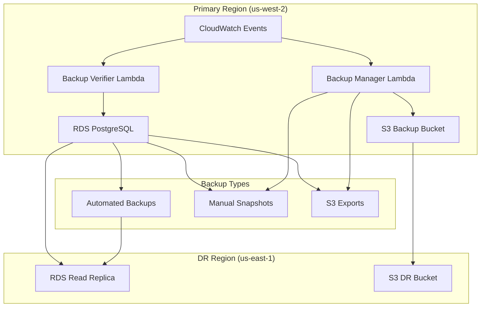

# Task 11.5: Test Backup and Disaster Recovery

## Overview

This guide provides comprehensive instructions for implementing, testing, and validating backup and disaster recovery (DR) systems for DhakaCart. The setup includes automated RDS backups, cross-region replication, Lambda-based backup management, and complete disaster recovery procedures.

## Prerequisites

Before implementing backup and disaster recovery, ensure you have:

1. **Infrastructure deployed** (Task 11.1 completed)
2. **Applications deployed** (Task 11.2 completed)
3. **Monitoring systems configured** (Task 11.4 completed)
4. **AWS CLI** configured with appropriate permissions
5. **Terraform** for infrastructure management
6. **Cross-region access** configured for DR region

## Architecture Overview

### Backup Strategy



### Recovery Objectives
- **RTO (Recovery Time Objective)**: 4 hours for complete infrastructure restoration
- **RPO (Recovery Point Objective)**: 15 minutes maximum data loss
- **Availability Target**: 99.9% uptime with automated failover
- **Backup Retention**: 30 days for automated backups, 90 days for manual backups

## Implementation Steps

### Step 1: Configure RDS Automated Backups

#### Enable Automated Backups

1. **Verify backup configuration**:
   ```bash
   aws rds describe-db-instances \
     --db-instance-identifier dhakacart-db \
     --query 'DBInstances[0].{BackupRetentionPeriod:BackupRetentionPeriod,BackupWindow:PreferredBackupWindow,MultiAZ:MultiAZ}'
   ```

2. **Modify backup settings** (if needed):
   ```bash
   aws rds modify-db-instance \
     --db-instance-identifier dhakacart-db \
     --backup-retention-period 30 \
     --preferred-backup-window "03:00-04:00" \
     --apply-immediately
   ```

#### Configure Point-in-Time Recovery

1. **Verify PITR is enabled**:
   ```bash
   aws rds describe-db-instances \
     --db-instance-identifier dhakacart-db \
     --query 'DBInstances[0].{EarliestRestorableTime:EarliestRestorableTime,LatestRestorableTime:LatestRestorableTime}'
   ```

2. **Test point-in-time recovery**:
   ```bash
   # Create test restore instance
   aws rds restore-db-instance-to-point-in-time \
     --source-db-instance-identifier dhakacart-db \
     --target-db-instance-identifier dhakacart-db-pitr-test \
     --restore-time "2024-01-01T12:00:00.000Z"
   ```

### Step 2: Deploy Lambda Backup Management

#### Deploy Backup Manager Lambda

1. **Create deployment package**:
   ```bash
   cd terraform/lambda/backup_manager
   zip -r ../../../backup_manager.zip .
   ```

2. **Deploy via Terraform**:
   ```bash
   cd terraform
   terraform apply -target=aws_lambda_function.backup_manager
   ```

3. **Test backup manager**:
   ```bash
   aws lambda invoke \
     --function-name dhakacart-backup-manager \
     --payload '{"action":"create_snapshot","type":"manual"}' \
     response.json
   ```

#### Deploy Backup Verifier Lambda

1. **Create deployment package**:
   ```bash
   cd terraform/lambda/backup_verifier
   zip -r ../../../backup_verifier.zip .
   ```

2. **Deploy via Terraform**:
   ```bash
   terraform apply -target=aws_lambda_function.backup_verifier
   ```

3. **Test backup verifier**:
   ```bash
   aws lambda invoke \
     --function-name dhakacart-backup-verifier \
     response.json
   ```

### Step 3: Configure S3 Backup Storage

#### Set Up Primary Backup Bucket

1. **Verify bucket configuration**:
   ```bash
   aws s3api get-bucket-versioning --bucket dhakacart-backups
   aws s3api get-bucket-encryption --bucket dhakacart-backups
   aws s3api get-bucket-lifecycle-configuration --bucket dhakacart-backups
   ```

2. **Test backup storage**:
   ```bash
   # Create test backup file
   echo "Test backup $(date)" > test-backup.txt
   aws s3 cp test-backup.txt s3://dhakacart-backups/test/
   aws s3 ls s3://dhakacart-backups/test/
   ```

#### Configure Cross-Region Replication

1. **Verify replication configuration**:
   ```bash
   aws s3api get-bucket-replication --bucket dhakacart-backups
   ```

2. **Test replication**:
   ```bash
   # Upload test file and check replication
   aws s3 cp test-backup.txt s3://dhakacart-backups/replication-test/
   
   # Wait a few minutes, then check DR bucket
   aws s3 ls s3://dhakacart-dr-backups/replication-test/ --region us-east-1
   ```

### Step 4: Set Up Cross-Region Database Replica

#### Create Read Replica in DR Region

1. **Create cross-region read replica**:
   ```bash
   aws rds create-db-instance-read-replica \
     --db-instance-identifier dhakacart-db-dr-replica \
     --source-db-instance-identifier arn:aws:rds:us-west-2:ACCOUNT:db:dhakacart-db \
     --db-instance-class db.t3.small \
     --region us-east-1
   ```

2. **Monitor replica status**:
   ```bash
   aws rds describe-db-instances \
     --db-instance-identifier dhakacart-db-dr-replica \
     --region us-east-1 \
     --query 'DBInstances[0].{Status:DBInstanceStatus,ReplicationLag:ReadReplicaDBInstanceIdentifiers}'
   ```

#### Configure Replica Monitoring

1. **Set up CloudWatch alarms for replica lag**:
   ```bash
   aws cloudwatch put-metric-alarm \
     --alarm-name "DhakaCart-DB-Replica-Lag" \
     --alarm-description "Monitor database replica lag" \
     --metric-name DatabaseConnections \
     --namespace AWS/RDS \
     --statistic Average \
     --period 300 \
     --threshold 300 \
     --comparison-operator GreaterThanThreshold \
     --dimensions Name=DBInstanceIdentifier,Value=dhakacart-db-dr-replica \
     --region us-east-1
   ```

### Step 5: Implement Automated Backup Scheduling

#### Configure EventBridge Rules

1. **Daily backup schedule**:
   ```json
   {
     "Rules": [
       {
         "Name": "DhakaCart-Daily-Backup",
         "ScheduleExpression": "cron(0 2 * * ? *)",
         "State": "ENABLED",
         "Targets": [
           {
             "Id": "1",
             "Arn": "arn:aws:lambda:us-west-2:ACCOUNT:function:dhakacart-backup-manager",
             "Input": "{\"action\":\"create_snapshot\",\"type\":\"daily\"}"
           }
         ]
       }
     ]
   }
   ```

2. **Weekly verification schedule**:
   ```json
   {
     "Rules": [
       {
         "Name": "DhakaCart-Weekly-Verification",
         "ScheduleExpression": "cron(0 4 ? * SUN *)",
         "State": "ENABLED",
         "Targets": [
           {
             "Id": "1",
             "Arn": "arn:aws:lambda:us-west-2:ACCOUNT:function:dhakacart-backup-verifier"
           }
         ]
       }
     ]
   }
   ```

### Step 6: Test Backup Procedures

#### Test Manual Snapshot Creation

1. **Create manual snapshot**:
   ```bash
   TIMESTAMP=$(date +%Y-%m-%d-%H-%M-%S)
   SNAPSHOT_ID="dhakacart-db-manual-test-$TIMESTAMP"
   
   aws rds create-db-snapshot \
     --db-instance-identifier dhakacart-db \
     --db-snapshot-identifier $SNAPSHOT_ID
   ```

2. **Monitor snapshot progress**:
   ```bash
   aws rds describe-db-snapshots \
     --db-snapshot-identifier $SNAPSHOT_ID \
     --query 'DBSnapshots[0].{Status:Status,Progress:PercentProgress}'
   ```

3. **Verify snapshot completion**:
   ```bash
   aws rds wait db-snapshot-completed \
     --db-snapshot-identifier $SNAPSHOT_ID
   ```

#### Test Snapshot Restoration

1. **Restore from snapshot** (creates new instance):
   ```bash
   RESTORE_ID="dhakacart-db-restore-test-$(date +%Y-%m-%d-%H-%M-%S)"
   
   aws rds restore-db-instance-from-db-snapshot \
     --db-instance-identifier $RESTORE_ID \
     --db-snapshot-identifier $SNAPSHOT_ID \
     --db-instance-class db.t3.micro
   ```

2. **Wait for restore completion**:
   ```bash
   aws rds wait db-instance-available \
     --db-instance-identifiers $RESTORE_ID
   ```

3. **Test restored database connectivity**:
   ```bash
   RESTORE_ENDPOINT=$(aws rds describe-db-instances \
     --db-instance-identifier $RESTORE_ID \
     --query 'DBInstances[0].Endpoint.Address' \
     --output text)
   
   # Test connection (requires database credentials)
   psql -h $RESTORE_ENDPOINT -U dhakacart_admin -d dhakacart -c "SELECT version();"
   ```

4. **Clean up test instance**:
   ```bash
   aws rds delete-db-instance \
     --db-instance-identifier $RESTORE_ID \
     --skip-final-snapshot
   ```

### Step 7: Test Disaster Recovery Procedures

#### Simulate Regional Failure

1. **Promote read replica to primary**:
   ```bash
   aws rds promote-read-replica \
     --db-instance-identifier dhakacart-db-dr-replica \
     --backup-retention-period 30 \
     --region us-east-1
   ```

2. **Wait for promotion completion**:
   ```bash
   aws rds wait db-instance-available \
     --db-instance-identifiers dhakacart-db-dr-replica \
     --region us-east-1
   ```

3. **Update application configuration**:
   ```bash
   NEW_ENDPOINT=$(aws rds describe-db-instances \
     --db-instance-identifier dhakacart-db-dr-replica \
     --region us-east-1 \
     --query 'DBInstances[0].Endpoint.Address' \
     --output text)
   
   echo "New database endpoint: $NEW_ENDPOINT"
   
   # Update Kubernetes secret
   kubectl patch secret dhakacart-secrets \
     -p '{"data":{"db-host":"'$(echo -n "$NEW_ENDPOINT" | base64)'"}}'
   ```

#### Test Application Connectivity

1. **Deploy applications in DR region**:
   ```bash
   # This would involve deploying EKS cluster and applications in DR region
   # For testing, you can use port-forward to test connectivity
   
   kubectl run db-test --image=postgres:15 --rm -it --restart=Never -- \
     psql -h $NEW_ENDPOINT -U dhakacart_admin -d dhakacart
   ```

2. **Verify data integrity**:
   ```sql
   -- Connect to promoted database and verify data
   SELECT COUNT(*) FROM products;
   SELECT COUNT(*) FROM information_schema.tables WHERE table_schema = 'public';
   ```

#### Test Failback Procedures

1. **Re-establish replication** (after primary region recovery):
   ```bash
   # This is a complex procedure that typically involves:
   # 1. Ensuring primary region is operational
   # 2. Creating new replica from DR region (now primary)
   # 3. Switching traffic back during maintenance window
   # 4. Re-establishing original replication direction
   ```

### Step 8: Implement Backup Monitoring and Alerting

#### Configure CloudWatch Alarms

1. **Backup failure alarm**:
   ```bash
   aws cloudwatch put-metric-alarm \
     --alarm-name "DhakaCart-Backup-Failures" \
     --alarm-description "Alert on backup failures" \
     --metric-name Errors \
     --namespace AWS/Lambda \
     --statistic Sum \
     --period 300 \
     --threshold 1 \
     --comparison-operator GreaterThanOrEqualToThreshold \
     --dimensions Name=FunctionName,Value=dhakacart-backup-manager
   ```

2. **Replica lag alarm**:
   ```bash
   aws cloudwatch put-metric-alarm \
     --alarm-name "DhakaCart-Replica-Lag-High" \
     --alarm-description "Alert on high replica lag" \
     --metric-name ReplicaLag \
     --namespace AWS/RDS \
     --statistic Average \
     --period 300 \
     --threshold 300 \
     --comparison-operator GreaterThanThreshold \
     --dimensions Name=DBInstanceIdentifier,Value=dhakacart-db-dr-replica \
     --region us-east-1
   ```

#### Set Up SNS Notifications

1. **Create SNS topic for backup notifications**:
   ```bash
   aws sns create-topic --name dhakacart-backup-notifications
   ```

2. **Subscribe to notifications**:
   ```bash
   aws sns subscribe \
     --topic-arn arn:aws:sns:us-west-2:ACCOUNT:dhakacart-backup-notifications \
     --protocol email \
     --notification-endpoint devops@dhakacart.com
   ```

### Step 9: Create Backup and DR Runbooks

#### Backup Runbook

Create `docs/runbooks/backup-procedures.md`:

```markdown
# DhakaCart Backup Procedures

## Daily Operations
1. Verify automated backup completion
2. Check backup Lambda function logs
3. Monitor S3 backup storage usage
4. Verify cross-region replication status

## Weekly Operations
1. Run backup verification Lambda
2. Test manual snapshot creation
3. Review backup retention policies
4. Check DR replica lag metrics

## Monthly Operations
1. Test point-in-time recovery
2. Verify backup restoration procedures
3. Review and update backup policies
4. Test disaster recovery procedures

## Emergency Procedures
1. Immediate backup creation
2. Point-in-time recovery execution
3. Cross-region failover activation
4. Data integrity verification
```

#### Disaster Recovery Runbook

Create `docs/runbooks/disaster-recovery-procedures.md`:

```markdown
# DhakaCart Disaster Recovery Procedures

## DR Activation Triggers
- Primary region complete outage (>30 minutes)
- Primary database failure (>15 minutes)
- Critical infrastructure failure
- Security incident requiring isolation

## DR Activation Steps
1. Assess situation and confirm DR activation
2. Promote DR replica to primary
3. Update DNS/load balancer configuration
4. Deploy applications in DR region
5. Verify application functionality
6. Communicate status to stakeholders

## Failback Procedures
1. Ensure primary region is fully operational
2. Sync data from DR to primary region
3. Schedule maintenance window
4. Switch traffic back to primary region
5. Re-establish DR replication
6. Verify all systems operational
```

## Validation Checklist

Mark each item as complete when validated:

### Backup Configuration
- [ ] RDS automated backups enabled with 30-day retention
- [ ] Backup window configured during low-traffic hours
- [ ] Multi-AZ deployment enabled for high availability
- [ ] Point-in-time recovery tested and working
- [ ] Manual snapshot creation tested
- [ ] Snapshot restoration tested successfully

### Lambda Backup Management
- [ ] Backup manager Lambda deployed and functional
- [ ] Backup verifier Lambda deployed and functional
- [ ] EventBridge rules configured for automated scheduling
- [ ] Lambda functions have appropriate IAM permissions
- [ ] SNS notifications configured and tested
- [ ] CloudWatch logs configured with retention policies

### S3 Backup Storage
- [ ] Primary backup bucket configured with encryption
- [ ] Bucket versioning enabled
- [ ] Lifecycle policies configured for cost optimization
- [ ] Cross-region replication configured and working
- [ ] DR backup bucket accessible and functional
- [ ] S3 access permissions properly configured

### Disaster Recovery Setup
- [ ] Cross-region read replica created and available
- [ ] Replica lag monitoring configured
- [ ] DR region infrastructure prepared
- [ ] Failover procedures documented and tested
- [ ] Failback procedures documented
- [ ] DNS/load balancer failover tested

### Monitoring and Alerting
- [ ] CloudWatch alarms configured for backup failures
- [ ] Replica lag monitoring and alerting
- [ ] SNS notifications working for all alert types
- [ ] Backup success/failure notifications configured
- [ ] Dashboard created for backup and DR monitoring
- [ ] Runbooks created and accessible to operations team

### Testing and Validation
- [ ] Manual backup creation tested
- [ ] Automated backup scheduling verified
- [ ] Point-in-time recovery tested
- [ ] Cross-region replication verified
- [ ] DR failover procedure tested
- [ ] Application connectivity to DR database tested
- [ ] Data integrity verification completed
- [ ] Performance impact of backups measured

## Expected Results

After successful implementation and validation:

### Backup System
- Automated daily backups with 30-day retention
- Manual backup capability for critical changes
- Point-in-time recovery available for any time within retention period
- Cross-region backup replication for disaster scenarios

### Disaster Recovery
- Cross-region database replica with minimal lag (<5 minutes)
- Documented failover procedures with 4-hour RTO
- Automated monitoring and alerting for DR readiness
- Regular DR testing and validation

### Monitoring and Compliance
- Real-time backup success/failure notifications
- Automated backup verification and integrity checking
- Compliance reporting for backup and retention policies
- Operational dashboards for backup and DR status

## Troubleshooting

### Common Backup Issues

1. **Backup failures**:
   - Check Lambda function logs in CloudWatch
   - Verify IAM permissions for backup operations
   - Check RDS instance status and availability
   - Verify S3 bucket accessibility and permissions

2. **High backup storage costs**:
   - Review backup retention policies
   - Implement lifecycle policies for older backups
   - Consider backup compression options
   - Monitor and optimize backup frequency

3. **Slow backup performance**:
   - Check backup window timing
   - Monitor RDS performance during backups
   - Consider Multi-AZ deployment for backup offloading
   - Review backup size and optimization opportunities

### Common DR Issues

1. **High replica lag**:
   - Check network connectivity between regions
   - Monitor primary database load
   - Verify replica instance size is appropriate
   - Check for long-running transactions

2. **Failover failures**:
   - Verify replica promotion permissions
   - Check application configuration updates
   - Test DNS/load balancer configuration
   - Verify network connectivity in DR region

3. **Data inconsistency after failover**:
   - Check replica lag at time of failover
   - Verify transaction log replay completion
   - Run data integrity checks
   - Compare data between regions if possible

### Debugging Commands

1. **Check backup status**:
   ```bash
   aws rds describe-db-snapshots --db-instance-identifier dhakacart-db
   aws logs describe-log-groups --log-group-name-prefix /aws/lambda/dhakacart-backup
   ```

2. **Monitor replica status**:
   ```bash
   aws rds describe-db-instances --db-instance-identifier dhakacart-db-dr-replica --region us-east-1
   aws cloudwatch get-metric-statistics --namespace AWS/RDS --metric-name ReplicaLag
   ```

3. **Check S3 replication**:
   ```bash
   aws s3api get-bucket-replication --bucket dhakacart-backups
   aws s3 ls s3://dhakacart-dr-backups --region us-east-1
   ```

## Security Considerations

- All backups encrypted at rest using KMS
- Cross-region replication uses encrypted transport
- IAM roles follow principle of least privilege
- Backup access logged and monitored
- DR procedures include security validation steps

## Cost Optimization

- Lifecycle policies for backup retention management
- Appropriate storage classes for different backup types
- Regular review of backup frequency and retention
- Monitoring of cross-region data transfer costs
- Optimization of backup compression and deduplication

## Next Steps

Once backup and disaster recovery validation is complete:

1. Proceed to Task 11.6: Validate security and compliance
2. Schedule regular DR drills and testing
3. Implement automated backup reporting
4. Set up backup cost monitoring and optimization
5. Create training materials for operations team

This completes the backup and disaster recovery implementation and validation for Task 11.5.